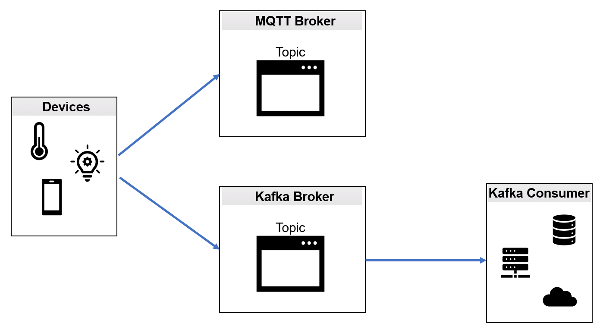

# 🚀 Kafka MQTT parallel implementation 🚀


Connect Kafka and MQTT — Option 1 (Image by author). Source : https://medium.com/python-point/mqtt-and-kafka-8e470eff606b

## requirement :
### Kafka installation :
1. install java jdk 8 or superior : https://www.oracle.com/fr/java/technologies/javase/javase-jdk8-downloads.html (because it's a requirement for installing kafka)
    1. open : edit the system environment variables
    1. Advanced > Environment variables > System variables > New
    1. Enter your java home path inside Variable name : `JAVA_HOME`
    1. Enter your directory where java is installed on your device inside Variable value : `C:\Program Files\Java\jdk1.8.0_291` 
    1. User variables > path > Edit > New and write : `%JAVA_HOME%\bin`
1. install apache kafka : https://www.apache.org/dyn/closer.cgi?path=/kafka/2.8.0/kafka_2.13-2.8.0.tgz
   1. open : edit the system environment variables
   1. User variables > path > Edit > New and write : `C:\kafka_2.13-2.8.0\bin\windows` your directory path for kafka

video for help find on youtube (code & dogs) : https://youtu.be/OjQilYHVHNQ
___
___

### Kafka configuration :
1. create a folder data inside your kafka directory and then after create folders kafka and zookeeper
1. go to your kafka directory > config and modify : server.properties :
```shell 
log.dirs=C:/kafka_2.13-2.8.0/data/kafka #your directory for server log created in 1st step 
```
3. go to your kafka directory > config and modify : zookeeper.properties :
```shell
dataDir=C:/kafka_2.13-2.8.0/data/zookeeper #your directory for zookeeper log created in 1st step 
```
___
___
### Kafka run :
1. open a cmd and run zookeeper first so do the following shell command inside your kafka directory > bin > windows : (for me : `C:\kafka_2.13-2.8.0\bin\windows`)
```shell
zookeeper-server-start.bat ../../config/zookeeper.properties
```
2. open a cmd and run kafka server so do the following shell command inside your kafka directory > bin > windows : (for me : `C:\kafka_2.13-2.8.0\bin\windows`)
```shell
kafka-server-start.bat ../../config/server.properties
```

___
___
___
## Kafka MQTT parallel implementation Quick-start
### Kafka run :
1. open a cmd and run zookeeper first so do the following shell command inside your kafka directory > bin > windows : (for me : `C:\kafka_2.13-2.8.0\bin\windows`)
```shell
zookeeper-server-start.bat ../../config/zookeeper.properties
```
2. open a cmd and run kafka server so do the following shell command inside your kafka directory > bin > windows : (for me : `C:\kafka_2.13-2.8.0\bin\windows`)
```shell
kafka-server-start.bat ../../config/server.properties
```

### You can run each 3 python file inside different console

