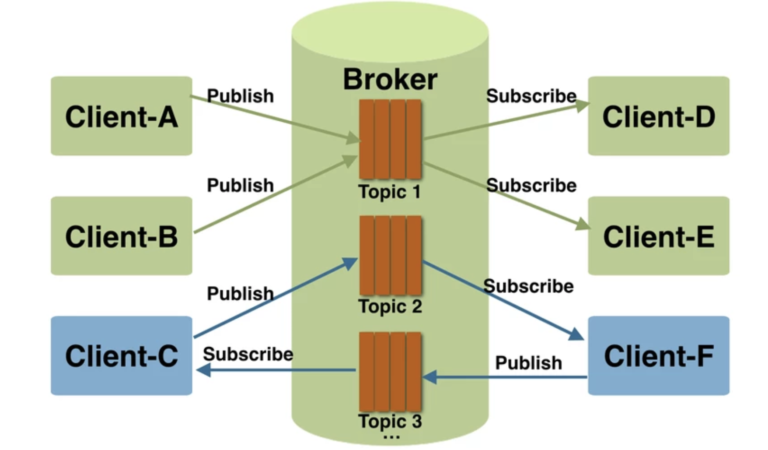

# 🚀 MQTT implementation 🚀

## Introduction :
MQTT is an open and simple client server publish/subscribe message transport protocol designed for machine-to-machine communication between different devices in environments of high latency and low network bandwith. It's a very light weigth protocole and have a short footprint.
More information about MQTT here : https://blog.engineering.publicissapient.fr/2018/04/16/internet-des-objets-quels-protocoles-applicatifs-utiliser-1-2/

In summary, the characteristics of the MQTT protocol make it suitable for IoT networks because it meets the following needs:
* Suitable for low bandwidth networks
* Ideal for use on wireless networks, thanks to a limited number of small messages
* Low energy consumption because the publication and consumption of messages is fast
* Requires few computing and memory resources
* Transmits a message to several entities in a single TCP connection

## MQTT schema :

Fonctionnement du protocole MQTT (source : https://blog.engineering.publicissapient.fr/2018/04/16/internet-des-objets-quels-protocoles-applicatifs-utiliser-1-2/)

## MQTT : Quality of services (QoS)
The Quality of Service (QoS) level is an agreement between the sender of a message and the receiver of a message that defines the guarantee of delivery for a specific message. There are 3 QoS levels in MQTT:
* At most once (QoS=0)
* At least once (QoS=1)
* Exactly once (QoS=2)

When you talk about QoS in MQTT, you need to consider the two sides of message delivery:
* Message delivery form the publishing client to the broker.
* Message delivery from the broker to the subscribing client.